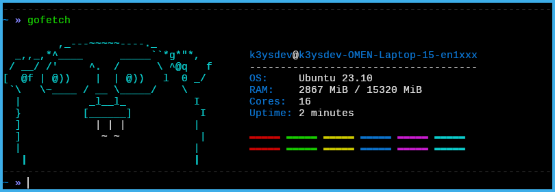

# Gofetch

A system fetch utility written in Golang.



### Prerequisites
* Golang (obviously)

### Installation

* Clone the repo
````bash
$ git clone https://github.com/k3yss/gofetch.git
````
* Build the binary
````bash
$ go build
````
* Copy the binary
````bash
$ cp gofetch /usr/local/bin/gofetch 
````
* Run
````bash
$ gofetch
````
### Docker
> Additionally you can use docker to run gofetch without installing any external dependencies.
````bash
$ docker build -t gofetch .
$ docker run -it gofetch
````
